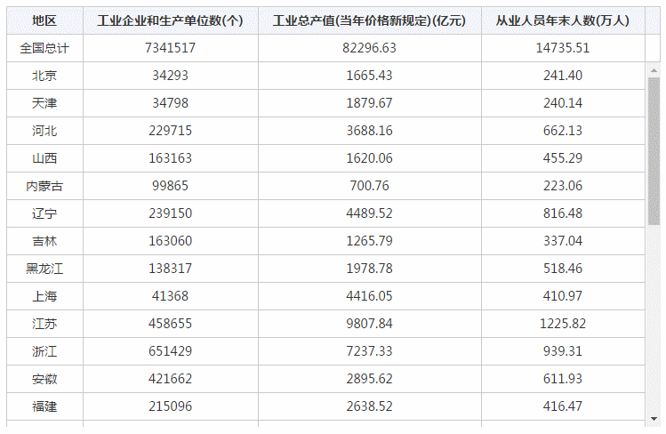
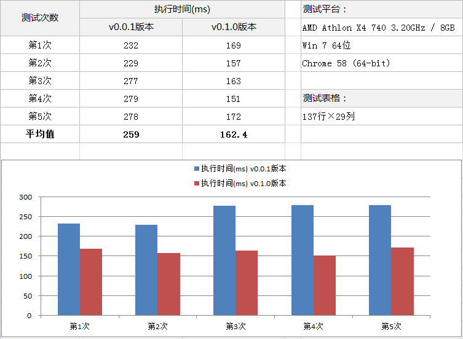

# 表头固定jQuery插件（fixedThead）
A jQuery plug-in for fixed table header

> 作者：Wing Meng
> 
> 2017-05-06　v0.1.0 重制版，规范代码组织结构，更新API，优化性能
> 
> 2016-08-23　v0.0.1 基础版本

[fixedThead.css](fixedThead.css) &emsp; [fixedThead.js](fixedThead.js) &emsp; [fixedThead.debug.js](fixedThead.debug.js)

## 一、描述

　　fixedThead是一款UI增强类的jQuery插件，用以固定表格表头（或称“冻结表头”），当表格太大超出父容器出现滚动条时，可保持表头位置固定，使用户在卷动查看表格内容时始终能看到表头信息，提升用户体验度。

## 二、特点

1.  **支持行表头和列表头固定：** 可通过row和col参数来设置要固定的行数和列数，可同时设置行、列固定。
2.  **对HTML结构要求极低：** 无需在表格中划分thead、tbody，也无需担心一行（列）中同时存在th、td的情况。
3.  **UI样式无侵入：** 用到的CSS仅包含实现排版用的定位属性，不会影响表格原有的其他UI样式（如颜色、字体、边框等）。
4.  **流体自适应宽度：** 采用流体宽度，自适应父容器宽度，自动判断是否出现滚动条。
5.  **自动响应尺寸变化：** 浏览器尺寸变化时自动调整布局，无论是由此引起的表格宽度变化还是单元格挤压内容换行高度变化。

## 二、适用场景

　　适用于纯展示型表格的表头固定，如非必要，请尽量不要在一个表格里同时使用行固定和列固定，会增加额外的HTML结构，性能上比单用行固定或列固定要低的多。另外如表格中元素绑定了交互事件，请慎用。

## 三、兼容性

　　兼容业界承认的主流浏览器，如Chrome、Safari、Firefox，IE8+（含）等，弱兼容移动端（移动端拖动内容时表头和表体部分同步存在延迟，但不影响最终显示）。
　　要求的 jQuery 最低版本为 1.4.2。

## 四、主要原理

　　表格复制法，将复制的表格充当表头部分，原表格充当表体部分，再利用CSS定位技巧来拼合成一个新表格。滚动条使用“表体”部分的滚动条，同时用JS监听滚动事件，动态获取表体内容的偏移值，再将该值赋给“表头”部分，使之同步移动。

## 五、使用方法及API

1.  引入插件CSS和JS文件：

    `<link rel="stylesheet" href="fixedThead.css" />` ``

    > 样式表（fixedThead.css）里只有区区几条代码，如有需要，可合并到其他样式表，例如公用样式表。
    > 
    > fixedThead.css文件请放在 <head></head> 标签内，fixedThead.js 文件请放在 jQuery 引入之后。

2.  表格可以是静态HTML表格，也可以是由JS动态生成的表格，推荐加上id，效率更高，另外表格中请勿使用 &lt;caption&gt; 标签：

    <pre>&lt;table class="表格原有的样式名称" id="table1"&gt;
        &lt;!-- 表格内容区域 --&gt;
    &lt;/table&gt;
    </pre>

    > 如果表格由JS动态生成，则 fixedThead() 方法需要在表格写入到文档之后再调用。
    > 
    > 错误示例：
    > 
    > <pre>var table = $('#table1');
    > table.fixedThead();
    > buildTable(table, serverData);  // 构建表格
    > </pre>

3.  调用插件：**`$(Selector).fixedThead(Options || Methods);`**

    > Selector 为要应用固定表头效果的表格选择器，可以是表格的 id 或 class，
    > 例如：$('#table1').fixedThead({row:2});

4.  参数（Options）

    | 参数 | 用途 | 属性值 |
    | --- | --- | --- |
    | **height** | 表格的最大高度，当表格实际高度超过该值时，出现垂直滚动条。例如： `$('#table1').fixedThead({height:400})` | 具体数值（单位为px）。默认为 auto，即高度占满并自适应可视区高度（一屏高度） |
    | **vspace** | 垂直预留空间，可为一屏内其他组件空出空间，例如需要将工具栏、表格同时显示在一屏内的场景。例如： `$('#table1').fixedThead({vspace:$('#toolBar').height()})` | 具体数值（单位为px），默认为 0 注意：只有当 height 属性为 auto 时才生效 |
    | **top** | 表格顶部外边距，例如： `$('#table1').fixedThead({top:20}); // margin-top:20px` | 具体数值（单位为px），默认为 0 |
    | **bottom** | 表格底部外边距，例如： `$('#table1').fixedThead({bottom:20}); // margin-bottom:20px` | 具体数值（单位为px），默认为 0 |
    | **row** | 需要固定的行数，从第一行开始计数。例如： `$('#table1').fixedThead({row:2})`，表示固定头两行 | 具体数值，默认为 1 |
    | **col** | 需要固定的列数，从左侧第一列开始计数。例如： `$('#table1').fixedThead({col:2})`，表示固定头两列 | 具体数值，默认为 0 |

    > 插件中会对上述参数的属性值进行校验，当设置的值不符合要求时，则采用默认值。

5.  设置统一参数：`$(Selector).fixedThead.option`

    　　有时我们需要将一些公用的参数提取出来进行统一设置来降低维护量，例如同一页面中有多个需要应用fixedThead插件的表格，且某些设置项相同，此时可使用统一参数设置功能。提供两种方式：

    *   **设置单个参数：** 后接对应的参数名来设置，例如： `$(Selector).fixedThead.option.vspace = 200;`
    *   **设置多个参数：** 后接参数设置对象，例如：

        <pre>$(Selector).fixedThead.option = {
        	vspace: 200,
        	row: 2,
        	col: 1 
        }</pre>

6.  方法（Methods）

    | 方法名 | 用途 | 示例 |
    | --- | --- | --- |
    | **refresh** | 刷新数据，当使用JS对表格的行、列进行了新增、删除操作后，调用此方法来更新表格结构 | `$('#table1').fixedThead('refresh')` |
    | **destroy** | 销毁实例，移除当前fixedThead插件所有的HTML结构及样式，还原当前表格到初始形态 | `$('#table1').fixedThead('destroy')` |

    > 注意：上述方法须在当前表格完成 fixedThead 初始化后调用才有效。

## 六、示例

1.  [静态表格调用](https://wingmeng.github.io/fixedThead/test/demo1.html)
2.  [同页面多表格调用](https://wingmeng.github.io/fixedThead/test/demo2.html)
3.  [调用与销毁](https://wingmeng.github.io/fixedThead/test/demo3.html)
4.  [多行多列固定](https://wingmeng.github.io/fixedThead/test/demo4.html)
5.  [JS增删表格处理](https://wingmeng.github.io/fixedThead/test/demo4.html)
6.  [实例：2016年一季度员工工资统计表](https://wingmeng.github.io/fixedThead/test/demo6.html) (170行×79列)

## 七、版本日志

#### - v0.1.0 <small>(2017-05-06)</small>

1.  取消了 autoFloat 这个并不实用的功能；
2.  maxHt 改名为 height；
3.  API新增 vspace, top 和 bottom；
4.  解决v0.0.1版本中当存在行、列同时固定的情况下，调整窗口尺寸布局会错乱的问题；
5.  规范化插件代码，重写UI构建部分，提升整体性能。

    

#### - v0.0.1 <small>(2016-08-23)</small>

　首个版本，实现基本的行固定功能。
